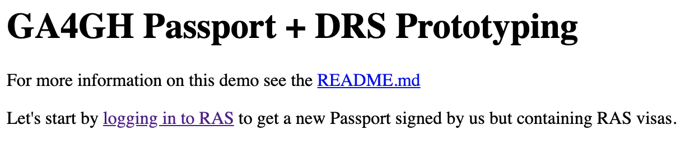
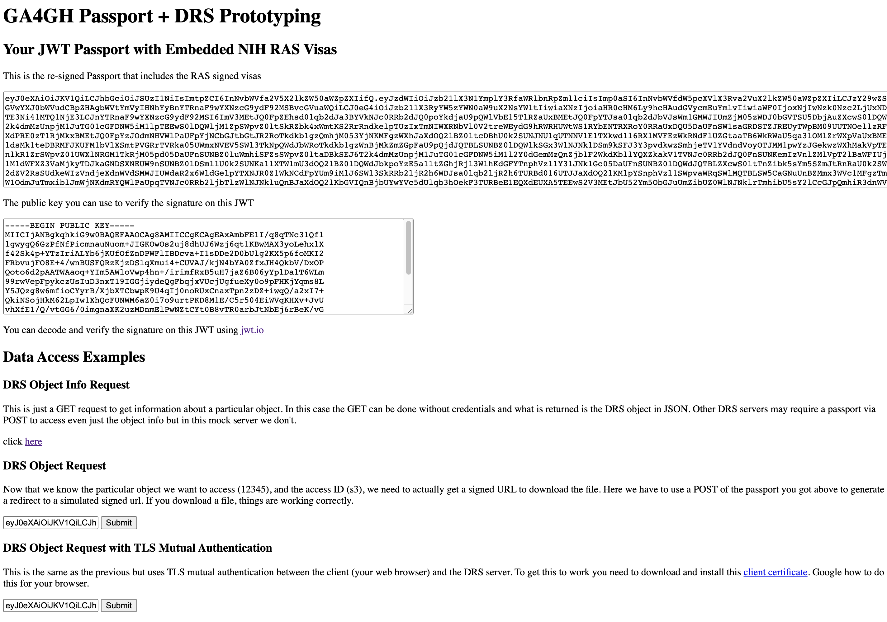
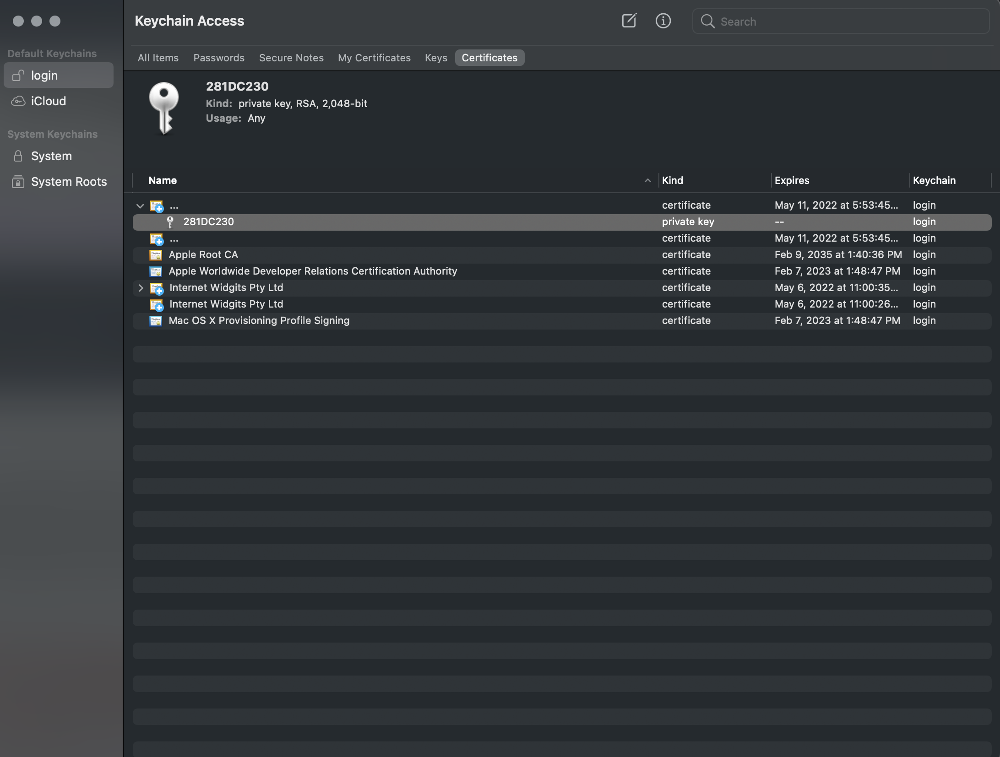
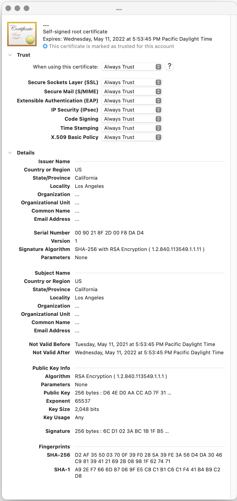
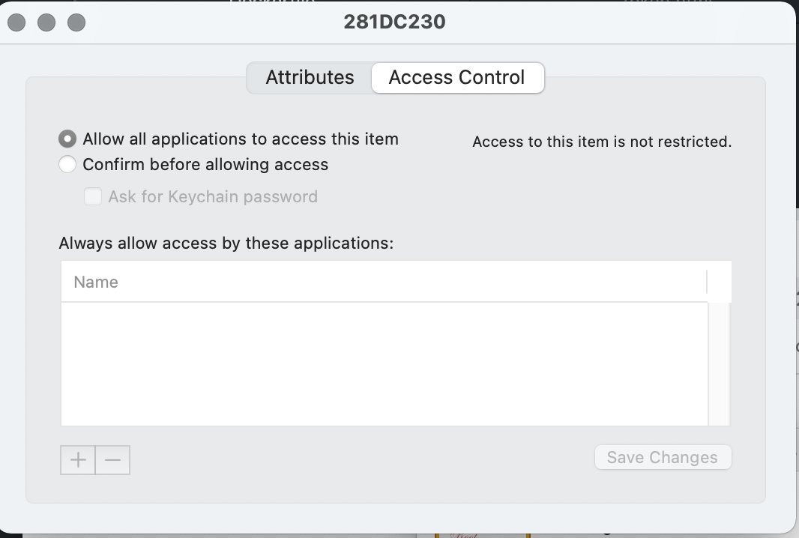
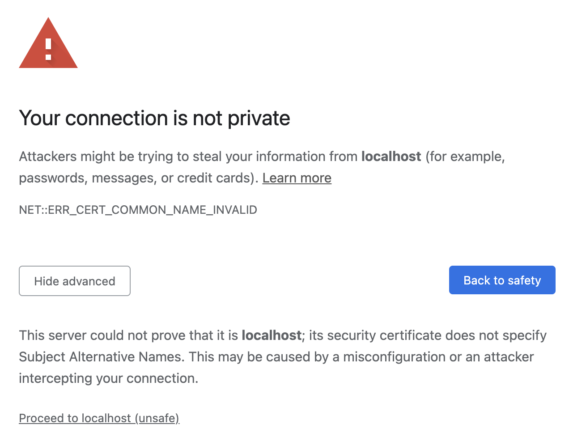

# GA4GH Passport + DRS Prototyping

## DEPRECATED

I merged the changes in this repo back into the parent [repo](https://github.com/broadinstitute/ras-passport-example).  Please use the parent repo.

## About

This repository was intended to provide a concrete example of using
[GA4GH Passports](https://github.com/ga4gh-duri/ga4gh-duri.github.io/blob/master/researcher_ids/ga4gh_passport_v1.md#passport)
with a [GA4GH DRS](https://github.com/ga4gh/data-repository-service-schemas) service to
identify and authorize users to access data. It is hoped this prototype will
address technical concerns about using NIH RAS passports to access
DRS servers (and the data they host) for the AnVIL, BioData Catalyst, CRDC, and Kids First NIH programs.
The design is discussed in more details in the document ['20210506 - RAS Authn/Authz "Milestone 3" Design with GA4GH Passports'](https://docs.google.com/document/d/1amOGLwAbKkMSU6up_dHGhsuUF9SVFlllO0qjQSJYuVI/edit#heading=h.ae0t5ovrzrv).

The non-production, demonstration services provided in this repository prototype the following:

* Repackaging and signing a GA4GH Passports from the [NIH RAS service](https://auth.nih.gov/docs/RAS/serviceofferings.html), see [original repo](https://github.com/broadinstitute/ras-passport-example) by Nicole B, I used her code
* Demonstrating how to POST a JWT passport to access a GA4GH DRS endpoint (using the [proposal](https://github.com/ga4gh/data-repository-service-schemas/issues/348) for supporting POST in DRS)
* Demonstrating how a client/DRS server can be secured with [Mutual TLS Authentication](https://en.wikipedia.org/wiki/Mutual_authentication)

### Origin

This project organization is inspired by, and forked from, this blog post:

[🐳 Simplified guide to using Docker for local development environment](https://blog.atulr.com/docker-local-environment/)

## Dependencies

To get this demo to work you will need three things:

* a RAS staging client ID and secret, contact the [RAS team](https://auth.nih.gov/docs/RAS/serviceofferings.html) to obtain this
* Docker (with docker-compose)
* ports 9000, 9001, 9002 available on your localhost


## Uses

You could adapt the code here to use other Passport Brokers beyond RAS.  However,
the code is focused on using RAS as a passport broker, repackaging the visas
in a new Passport, and using that to access data via the DRS API (both
through a POST and also a POST with mutual TLS authentication).
This service is acting as a Passport Broker itself but is
not fully functional.

There are many ways you could use this code:

* as a starting point for building a GA4GH Passport Broker that combines visas from multiple Brokers into a single passport for use with GA4GH and other APIs
* as a starting point to implement a DRS server that support POST'ing of Passports as an alternative to standard, OAuth2 bearer tokens
* as a starting point for implementing a mutual TLS authentication strategy for a DRS server and "approved" client(s)

## Architecture

This docker-compose will spin up two Docker containers:

* nginx: this serves up some standard http content on 9002, SSL secured content on 9001 that includes mutual authentication
* py-dev: this runs the mock DRS server and also contains a python dev environment and example scripts if you want to re-sign and re-package a Passport using a script instead of the web flow.  The service runs on 9000.

## Setup

Setup is pretty simple.  The service's certificates are automatically built when
the nginx service is built and the public/private keys used to re-sign the
Passport are checked into the repo.  The only thing you need to configure is the following file:

    cp services/py1/server/config_template.py services/py1/server/config.py

And then edit the config.py file:

```
# my config

auth = {
    'client_id': '<client_id_from_ras>',
    'client_secret': '<client_secret_from_ras>',
    'redirect_uri': 'http://localhost:9000/fence-callback'
}

ras_login = {
    'ras_username': '<username>',
    'ras_password': '<passpord>'
}

new_passport = {
    'iss': 'https://app.terra.bio',
    'preferred_username': '<username>@era.nih.gov',
    'email': '<username>@ras.test.nih.gov',
}
```

Some tips:

* you will get the client ID, secret, username, and password from the RAS team  
* request http://localhost:9000/fence-callback as your callback, otherwise you'll have to modify code
* the "new_passport" content is really not that important, you define them for your app. Here we mocked this as app.terra.bio for the Broad's Terra platform.

## Running

### Launching Services

To run the example:

`docker-compose up` or `docker-compose up --build` if you want to rebuild or `docker-compose up -d` if you want to avoid console output

***Keep in mind, when you build it may cause your certificates to be replaced with new ones and you may have to setup the client certificate again as described below***

### Demo Web App

#### Login and Repackaged Passport Generation

If everything came up OK, go to the following address:

    http://localhost:9002/



Click on the log in to RAS link and use your test RAS account.

#### Using the Passport to Access a DRS File

If you successfully log in you will see the following page:



You can do four different things on this page:

1. Copy and paste the JWT Passport into [JWT.io](https://jwt.io) and verify with the pubic key
1. Access the DRS object info (for object 12345) via a simple, unauthenticated GET (I made this open)
1. Access the DRS object by POST'ing the Passport JWT... this returns a mock signed URL and the browser downloads a cram file
1. The same as the previous but this time, uses client mutual authentication using a client certificate that you have to install in your browser (see below)

#### Setting up Client Certificate for Mutual Authentication

One of the challenges of working with mutual authentication in this demo is
properly setting up the certificate in your browser.  To do that:

1. Use Chrome, I used Chrome on the Mac
1. download the client certificate from the page above.  It is a client.pfx file.
1. double-click the client.pfx and follow the prompts to add it to your Keychain (assuming you're using a Mac).  The password is "password"

At this point it will still not work.  You need to open up the Keychain Access app:



Double click on both of the "..." certificates (one is the server, one is the client).  Make sure you select
Always Trust in the trust section:



Next, click on the key icon and choose "Allow all applications to access this item" under Access Control:



When you then click on the "DRS Object Request with TLS Mutual Authentication" you will (likely) get the following in Chrome:



Show advanced and then click "Proceed to localhost (unsafe)"

If everything works then the sample cram file should download.

***Obviously, none of this would be required if the server/client certificates were not self-signed but proper certificates from a known/trusted certificate authority as you would do for a production system.***

## Next Steps

In the future we could improve this demo code by:

* adding different options for GA4GH Passport Brokers beyond NIH RAS
* supporting this service as a full-featured Passport Broker 
* support for more full-featured DRS servers beyond the mock one in this demo
* ensuring mutual authentication works on multiple browsers beyond Chrome
* moving to a plugin for apache or nginx that can do mutual authentication plus other filtering (such as geolocation and user restrictions)
* move to pre-generated certificates to make it easier to setup clients (avoid having to import client certificates each time the server builds)

**Keep in mind, this is demo code and is not intended for production systems.**

## More Details

I'm providing more details below for those that are interested.  None of this is required
if you only want to demo (and extend) the web server-based approach. The script described
below was an earlier version but it does dump more information than the web service,
which can be useful for understanding the OAuth2 and Passport flow with RAS.

### Repackaging NIH RAS GA4GH Passport into a new GA4GH Passport using a Script

A prototype to show how a client could repackage an NIH RAS passport into a new signed passport. Both the passport and the visas are encoded.

To run you'll need to update the config. You will need the following:
1. client_id and client_secret for getting the RAS access token.
2. Redirect uri known to RAS
3. RAS test user and password
4. For the repackaged passport, you can add an issuer and email or leave blank.
6. Copy config_template.py and rename to config.py

You will also need an RSA private key for encoding the new passport. Place in same directory as repack_passport.py. To create a key (this is already checked into the repo so you don't need to do this):
```
ssh-keygen -t rsa -b 4096 -m PEM -f jwtRS256.key
# Don't add passphrase
openssl rsa -in jwtRS256.key -pubout -outform PEM -out jwtRS256.key.pub
cat jwtRS256.key
cat jwtRS256.key.pub
```

#### How to run:  
```
cd ras-passport-example
virtualenv -p python3.7 venv && . venv/bin/activate && pip install -r requirements.txt
python3 repack_passport.py
```
**Note:**
You will be prompted to put the RAS authorize url into a browser and login with your RAS test user. After logging in take that new url and paste into the cmd line to proceed.

### Repackaging NIH RAS GA4GH Passport into a new GA4GH Passport using a Script - Docker Based

Instead of running the script directly on your computer, you can launch the containers
with Docker compose as described above and then connect to a python development
environment with everything installed and ready to go.  This is useful for both
trying out the repack_passport.py script and also modifying the web service described
in the previous sections.

#### Connecting to Python Dev Environment

Once you launch with `docker-compose up` you can login in to the Python service
container using:


    $> bash connect.sh
    # inside the Docker container
    #> cd ~/py-dev/scripts/repackage_python_script

#### Executing the Python Script

    #> python repack_passport.py


### Demonstrating POST'ing a Passport JWT to a Mock DRS Server

#### Creating Token

Take the token from "Broad_encoded_passport.txt"

  % export token=`cat ./working/scripts/repackage_python_script/Broad_encoded_passport.txt`
  % curl -X POST -d "token=$token" 'http://localhost:9000/ga4gh/drs/v1/objects/12345'

The return is a DRS response.  If you get a stacktrace then the verification of the signature was likely incorrect.
The service is referencing the file /root/py-dev/scripts/repackage_python_script/jwtRS256.key.pub in the
container so make sure you create that in the repackaging example above and
run through the whole login flow to generate the resigned JWT ("Broad_encoded_passport.txt").

### Example Client-Server Mutual Authentication with Nginx

This needs to be built into the Dockerfile for a second python based service.
But for now, I'm following the tutorial here:

https://levelup.gitconnected.com/certificate-based-mutual-tls-authentication-with-nginx-57c7e693759d

With one note, the following line should be:

  ssl_verify_client       on;

Not "yes" as it is in the tutorial.

I also connected to localhost:9000 for the proxy instead of localhost:5000 in the tutorial.

```
server {
        listen 80 default_server;
        listen [::]:80 default_server;

        # SSL configuration
        #
        listen 443 ssl default_server;
        listen [::]:443 ssl default_server;
        ssl_certificate         /etc/ssl/selfsigned/server.crt;
        ssl_certificate_key     /etc/ssl/selfsigned/server.key;
        ssl_client_certificate  /etc/ssl/selfsigned/client.crt;
        ssl_verify_client       on;

...

location / {
        # First attempt to serve request as file, then
        # as directory, then fall back to displaying a 404.
        #####try_files $uri $uri/ =404;
        proxy_pass http://localhost:9000/;

}
```
